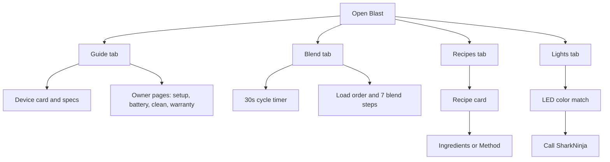

# Blast

Native iPhone companion for the Ninja Blast portable blender (series BC100BZ). It is the quick guide, LED decoder, 30-second blend timer, and the five recipes from the manual.

Bundle id: `app.blast.guide`

Home screen name: **Blast**

Project path: `/Users/mike/Documents/NinjaBlast`



## Mobbin references

Screens were matched before layout.

| Screen in Blast | Matched to | mobbin_url |
| --- | --- | --- |
| Home device card | LARQ pitcher home | https://mobbin.com/screens/089f7846-ad73-41f7-a128-46bd18ae346b |
| Guide topic rows | Tesla Video Guides | https://mobbin.com/screens/d9425f65-5578-468a-8c60-1329be7ecfb2 |
| Spec tiles | Mercedes-Benz car status | https://mobbin.com/screens/56a361b4-84db-48cf-a4f4-58e398914361 |
| Blend timer ring | Garmin Connect hydration | https://mobbin.com/screens/c6ba672b-b16b-441b-aa65-48c750299e19 |
| Recipe cards | Crouton All Recipes | https://mobbin.com/screens/45d8071c-4dfb-4274-96c9-83f473472322 |
| Recipe ingredients and numbered method | Crouton recipe detail | https://mobbin.com/screens/fc2cd391-15e3-4072-bbb2-50247808e0ce |
| LED decoder rows | Tesla Browse Support | https://mobbin.com/screens/2abbd7b0-f585-45c3-a682-c759a6eb8ef7 |

Also reviewed: [MyDyson](https://mobbin.com/screens/c1db412e-a137-4995-9ef3-bb6941513160), [NYT Cooking preparation](https://mobbin.com/screens/c039344e-0952-4822-be6c-11928c975d19), [Polestar timer](https://mobbin.com/screens/2b14f5c9-8a20-403a-bc08-4ed38c4574a6).

## Build and install

Signing matches Packet: Automatic style, team `N7LRRN2YGY`.

```
cd /Users/mike/Documents/NinjaBlast
xcodegen generate
xattr -cr Blast
xcodebuild -project Blast.xcodeproj -scheme Blast \
  -destination 'id=00008150-00180DA63644401C' \
  -allowProvisioningUpdates \
  DEVELOPMENT_TEAM=N7LRRN2YGY \
  -derivedDataPath /tmp/Blast-dd \
  build
xcrun devicectl device install app --device 613E0636-1C1C-559C-80D5-D49470A531B2 \
  /tmp/Blast-dd/Build/Products/Debug-iphoneos/Blast.app
```

Use `/tmp/Blast-dd` so Documents xattrs do not break codesign. Swipe-kill Blast and reopen after install.
