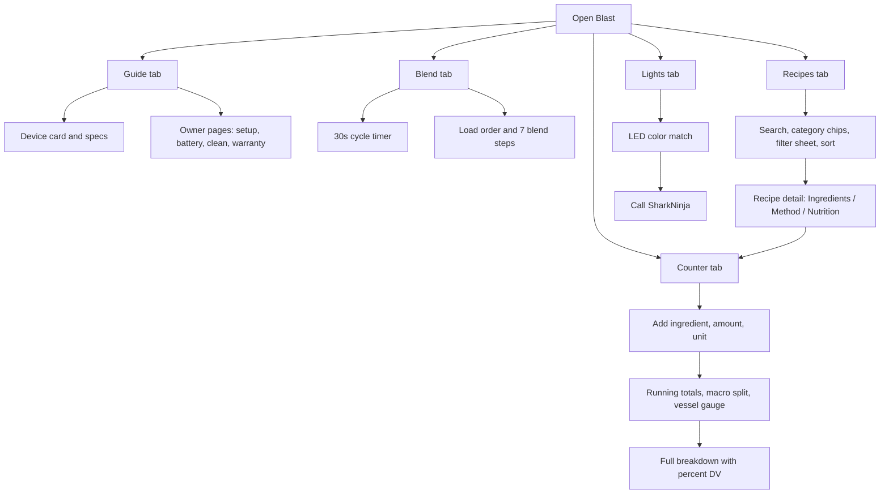

# Blast

Native iPhone companion for the Ninja Blast portable blenders. It covers two devices, switchable from the segmented control on the Guide tab or the menu in every other tab:

| Device | Series | Vessel | Controls |
| --- | --- | --- | --- |
| Blast | BC100BZ | 470 ml · 16 oz | Power + Start/Stop, 30 s cycle |
| Blast MAX | BC200 | 590 ml · 20 oz | Dial: Blend / power / Crush, plus Auto-iQ |

Each device carries its own specs, owner's-guide topics, blend steps, load order, cleaning, troubleshooting, LED rows, and box-insert recipes. The MAX content comes from the BC200 quick-start card and recipe insert; where that card documents nothing (LED codes other than the green ready light, parts list, storage), the app says so rather than borrowing the BC100 answer.

Five tabs: **Guide**, **Blend** (cycle timer), **Recipes** (299 per device), **Counter** (nutrition tracker), **Lights** (LED decoder).

Bundle id: `app.blast.guide`

Home screen name: **Blast**

Project path: `/Users/mike/Documents/NinjaBlast`



## Recipes and nutrition

`Blast/Resources/foods.json` (181 ingredients) and `recipes.json` (294 recipes) are generated, never hand-edited:

```
python3 scripts/build_data.py
```

`scripts/recipes_data.py` holds the recipe rows — name, servings, prep time, `(food_id, amount, unit)` ingredients, tip. `build_data.py` holds the ingredient table with per-100 g nutrition, cup/piece weights, and dietary flags, then assembles the JSON: it resolves every food id, picks BLEND or CRUSH from the ingredients, and scales bulk ingredients down until the recipe fits the vessel (protein scoops and spices stay fixed). It prints a report — category counts, how many fit each vessel, kcal spread — so a bad row is visible before the build.

The 10 box-insert recipes live in `Blast/Nutrition/PrintedRecipes.swift` instead, quoting the printed wording and directions verbatim and pinned to the device they shipped with — so each device shows its own 5 plus the shared 294. The library recipes have no stored steps; `Recipe.steps(for:)` generates them from the device's load order and program, the way Ninja's own inserts repeat the same directions on every card.

Dietary tags (vegan, dairy-free, nut-free, gluten-free, caffeine, alcohol) and the high-protein / low-sugar / high-fiber tags are **derived** from ingredient flags and computed nutrition at read time, so a filter can never disagree with what is in the cup.

The Counter tab is the same data in reverse: add what you are actually putting in, in whatever unit suits it, and it tracks kcal, macros, fiber, sugar, vessel volume against the MIN LIQUID and MAX FILL lines, and percent DV. "Send to Counter" on any recipe loads its ingredients in so you can adjust from there. The in-progress blend persists across launches.

## Mobbin references

Screens were matched before layout.

| Screen in Blast | Matched to | mobbin_url |
| --- | --- | --- |
| Home device card | LARQ pitcher home | https://mobbin.com/screens/089f7846-ad73-41f7-a128-46bd18ae346b |
| Guide topic rows | Tesla Video Guides | https://mobbin.com/screens/d9425f65-5578-468a-8c60-1329be7ecfb2 |
| Spec tiles | Mercedes-Benz car status | https://mobbin.com/screens/56a361b4-84db-48cf-a4f4-58e398914361 |
| Blend timer ring | Garmin Connect hydration | https://mobbin.com/screens/c6ba672b-b16b-441b-aa65-48c750299e19 |
| Recipe cards | Crouton All Recipes | https://mobbin.com/screens/45d8071c-4dfb-4274-96c9-83f473472322 |
| Recipe ingredients and numbered method | Crouton recipe detail | https://mobbin.com/screens/fc2cd391-15e3-4072-bbb2-50247808e0ce |
| LED decoder rows | Tesla Browse Support | https://mobbin.com/screens/2abbd7b0-f585-45c3-a682-c759a6eb8ef7 |

Also reviewed: [MyDyson](https://mobbin.com/screens/c1db412e-a137-4995-9ef3-bb6941513160), [NYT Cooking preparation](https://mobbin.com/screens/c039344e-0952-4822-be6c-11928c975d19), [Polestar timer](https://mobbin.com/screens/2b14f5c9-8a20-403a-bc08-4ed38c4574a6).

## Build and install

Signing matches Packet: Automatic style, team `N7LRRN2YGY`.

```
cd /Users/mike/Documents/NinjaBlast
scripts/install.sh          # both phones (default)
scripts/install.sh mike     # Mike's iPhone 17 Pro Max only
scripts/install.sh liana    # Liana's iPhone 12 Pro Max only
```

The script generates the project, builds Release, and installs + launches over the local network. Both phones need to be unlocked and on the same Wi-Fi. Builds land in `/tmp/Blast-dd` so Documents xattrs do not break codesign.

## Simulator screenshots

Taps sent with AppleScript do not reach the Simulator's render surface, so drive state through defaults instead:

```
xcrun simctl spawn booted defaults write app.blast.guide blast.screenshotTab -int 2
xcrun simctl spawn booted defaults write app.blast.guide blast.selectedDevice -string blastMax
xcrun simctl launch booted app.blast.guide
```

Tabs are 0 Guide, 1 Blend, 2 Recipes, 3 Counter, 4 Lights. Device values are `blast` and `blastMax`. On-device screenshots: `xcrun devicectl device capture screenshot --device <id> --destination shot.png`.

For taps that must land on the render surface, `scripts/simclick.swift` posts real CGEvents and `scripts/tap.sh x y` maps screenshot coordinates through the Simulator's `group 1 of window 1` geometry (the window frame is the wrong origin — it includes chrome). Typing into a `.searchable` field this way still does not focus; drive list filtering through the category chips instead.
